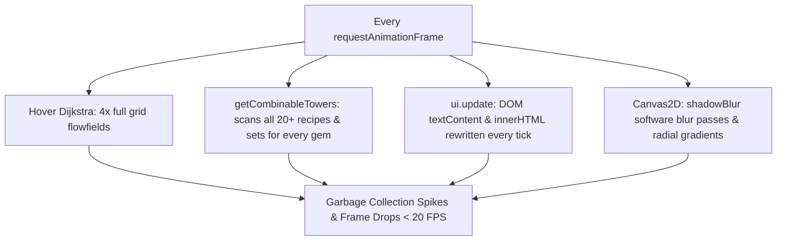
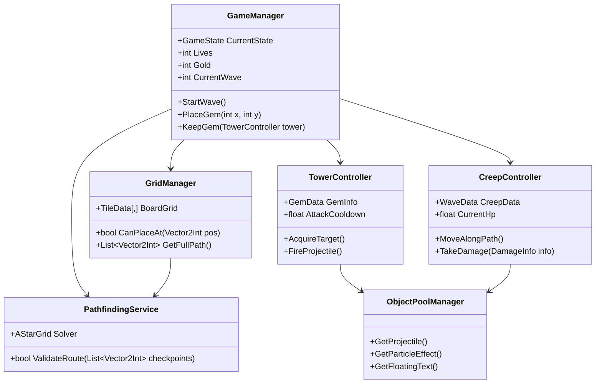

# Performance Optimization & Unity Native Port Plan

## Goal Description
The browser version of Gem TD currently experiences noticeable lags and stuttering, raising the question: **Can this be moved to Unity to create a native game?**

This document provides:
1. **The diagnosis of why the browser version is stuttering**: It is not an inherent limitation of JavaScript or browsers, but rather 4 specific computational bottlenecks running inside the 60 FPS animation frame loop (such as computing 4 Dijkstra flowfields every frame on mouse hover, and scanning all 20+ recipes for every tower every frame).
2. **A concrete architecture and roadmap for porting the game to Unity (C#)** for a native desktop (.exe / Steam / Mac / Mobile) title.
3. **An immediate, in-place browser optimization fix** that can make the current web game run at a locked 60/120 FPS with zero stutter right now.

```
                    ┌────────────────────────────────────────────────────────┐
                    │                    Gem TD Direction                    │
                    └───────────────────────────┬────────────────────────────┘
                                                │
                 ┌──────────────────────────────┴──────────────────────────────┐
                 ▼                                                             ▼
     ┌────────────────────────┐                                   ┌────────────────────────┐
     │  Browser Optimization  │                                   │   Unity Native Port    │
     │     (Immediate Fix)    │                                   │    (Desktop / Steam)   │
     ├────────────────────────┤                                   ├────────────────────────┤
     │ • Eliminate lag now    │                                   │ • Standalone .exe / App│
     │ • Locked 60/120 FPS    │                                   │ • 3D faceted gems/VFX  │
     │ • 0 new tools/installs │                                   │ • C# IL2CPP speed      │
     │ • ~30 min fix          │                                   │ • Requires Unity setup │
     └────────────────────────┘                                   └────────────────────────┘
```

---

## Root Cause Analysis: Why the Browser Stutters

Profiling the codebase revealed that the browser is running heavy $O(N)$ and $O(N^2)$ algorithmic loops **every single frame (60–120 times/second)**:



1. **Hover Pathfinding Recalculation Every Frame ([`drawHoverTile` in `js/renderer.js#L619-L633`](file:///c:/Users/tomer/gem-td/js/renderer.js#L619-L633))**:
   - `drawHoverTile` calls `game.canPlaceAt(x, y)` every frame while the mouse hovers over the board.
   - `canPlaceAt` invokes `validateFullRoute(grid)` ([`js/pathfinding.js#L171-L182`](file:///c:/Users/tomer/gem-td/js/pathfinding.js#L171-L182)), which computes **4 Dijkstra flowfields** over a 37x37 grid using a linear search array priority queue (`queue.splice(minIdx, 1)`).
   - This consumes 15–40 ms of CPU time per frame on mouse movement, blowing past the 16.6 ms frame budget.
2. **Combinations Computed Every Frame ([`drawTowersAndSlates` in `js/renderer.js#L176`](file:///c:/Users/tomer/gem-td/js/renderer.js#L176))**:
   - `renderer.drawTowersAndSlates` calls `game.getCombinableTowers()` every frame.
   - It iterates over all active gems and runs `findCombinationsForTower(g, allGems)`, evaluating 20+ recipes with array filtering and Set allocations. With 40 towers, that is 800+ recipe comparisons and thousands of object allocations per second, triggering constant V8 garbage collection stutter.
3. **Inspector Key Combination Search ([`getInspectorKey` in `js/ui.js#L543`](file:///c:/Users/tomer/gem-td/js/ui.js#L543))**:
   - Called on every frame tick inside `ui.update()` to determine if the inspector panel needs re-rendering.
4. **Canvas2D `shadowBlur` and `createRadialGradient` ([`js/renderer.js`](file:///c:/Users/tomer/gem-td/js/renderer.js))**:
   - `ctx.shadowBlur` on text, rune orbits, and lightning arcs forces the browser to perform software rasterization passes instead of fast hardware blits.

---

## User Review Required

> [!IMPORTANT]
> **Two clear paths forward are available:**
> 1. **Immediate Web Optimization**: We can resolve the 4 bottlenecks above directly in the JavaScript code today. This will bring the game to a locked 60/120 FPS with zero stuttering in your browser immediately.
> 2. **Full Unity Port**: If you want a native desktop executable (.exe for Windows / macOS / Steam) with 3D graphics, controller support, and native C# performance, we can port the game to Unity. Note that Unity is not currently installed on this system, so you will need to install Unity Hub and a Unity LTS editor (e.g., Unity 2022.3 LTS or Unity 6).

> [!WARNING]
> A full Unity port involves rewriting the game logic in C#, building Unity UI Canvas prefabs, configuring ScriptableObjects, and setting up rendering assets. It is a substantial migration compared to a quick in-place performance optimization.

---

## Open Questions

> [!NOTE]
> 1. **Primary Goal**: Do you want to move to Unity specifically to eliminate lag, or do you want a native desktop release (e.g., 3D graphics, Steam integration, installer)?
> 2. **Unity Version & 2D vs 3D**: If moving to Unity, do you prefer a **3D perspective** (faceted 3D gemstone models, dynamic lighting, camera pitch) or a **2D Sprite/Tilemap** style matching the current design?
> 3. **Desktop Packaging Alternative**: Would an **Electron or Tauri** desktop app (native `.exe` bundling the optimized web game) satisfy the native app requirement with a fraction of the migration effort?

---

## Proposed Plan: Phase 1 — Immediate Browser Performance Fix

This fixes the browser stutter immediately by introducing state-dirty caching and removing per-frame allocations.

### Grid & Pathfinding Optimization
#### [MODIFY] `js/pathfinding.js`
- Replace linear-search array Dijkstra (`queue.splice(minIdx, 1)`) with a fast binary min-heap or 1D indexed flat queue.
- Cache route validity and segment results so unmodified boards don't re-run flowfield computations.

#### [MODIFY] `js/game.js`
- Cache `combinableTowers` in `Game`. Only recompute this Set when:
  - A gem is placed
  - A gem is chosen / turned into slate
  - A tower combines or upgrades
  - A tower is relocated or removed
- Cache `hoverTileCanPlace` so `canPlaceAt` is only evaluated when `hoverTile` coordinates actually change (on `mousemove`), never on every animation frame.
- Cache `allTowers` list in `Game` rather than re-scanning the 37x37 grid every frame in `updateTowerAuras()`.

#### [MODIFY] `js/ui.js`
- Cache `combos` in `Tower` / `Game` so `getInspectorKey()` does not run recipe searches every frame.
- Throttle `updateHUD()` to trigger only when game state changes (lives, gold, wave, score, phase) rather than unconditionally 60 times a second.

#### [MODIFY] `js/renderer.js`
- Remove `ctx.shadowBlur` on continuous frame draws; replace with pre-baked glow sprites or clean alpha halos.
- Cache checkpoint and trap gradients to offscreen canvases or simple color rings.

---

## Proposed Plan: Phase 2 — Unity Native Game Architecture

If moving to Unity, here is the architecture for the native C# port.



### 1. Unity Project Structure
```
Assets/
├── Scripts/
│   ├── Core/
│   │   ├── GameManager.cs          (State machine: Building, Choosing, Wave, Victory, GameOver)
│   │   ├── Config.cs               (Constants, checkpoint coordinates, chances)
│   │   └── ObjectPoolManager.cs    (Projectiles, floating damage text, particle effects)
│   ├── Grid/
│   │   ├── GridManager.cs          (37x37 cell matrix, coordinate transforms)
│   │   ├── PathfindingService.cs   (A* / Dijkstra multi-checkpoint solver)
│   │   └── CellHighlight.cs        (Hover and placement valid/invalid indicator)
│   ├── Towers/
│   │   ├── TowerController.cs      (Targeting, auras, attack speed, cooldowns)
│   │   ├── GemData.cs              (ScriptableObject: type, quality, damage, range, effects)
│   │   ├── RecipeDatabase.cs       (ScriptableObject: recipes, components, duplicate upgrades)
│   │   └── Projectile.cs           (Homing / ballistic projectiles, hit detection)
│   ├── Creeps/
│   │   ├── CreepController.cs      (Path following, debuffs: slow, poison, burn, stun, shield)
│   │   └── WaveData.cs             (ScriptableObject: wave index, count, hp, armor, traits)
│   ├── Shop/
│   │   ├── ShopManager.cs          (Tower relocation, socketable runes, tactical traps, castle heal)
│   │   └── RuneData.cs             (ScriptableObject: socket effects)
│   └── UI/
│       ├── UIManager.cs            (HUD: lives, gold, wave; Dock; Modal manager)
│       ├── TowerInspectorUI.cs     (Damage, DPS, combination partner previews)
│       └── CodexUI.cs              (Searchable recipe book and combine buttons)
├── ScriptableObjects/
│   ├── Gems/                       (Chipped Ruby -> Perfect Diamond, Specials)
│   ├── Recipes/                    (Silver, Malachite, Star Ruby, Ehome, Uranium...)
│   └── Waves/                      (Waves 1-50 data assets)
├── Prefabs/
│   ├── Towers/                     (Base gem prefab, slate prefab)
│   ├── Creeps/                     (Ground, flying, boss creep prefabs)
│   ├── Projectiles/                (Arrow, lightning, frost, arcane orb)
│   └── VFX/                        (Combine fanfare, explosions, floating text)
└── Scenes/
    └── MainGame.unity
```

### 2. Key Technical Implementations in Unity
- **ScriptableObjects**: All gem qualities (Chipped, Flawed, Regular, Flawless, Perfect), 20+ special tower recipes, 50 wave definitions, runes, and traps are authorable directly in the Unity Inspector without recompiling.
- **Zero-Allocation Object Pooling**: Projectiles, floating damage numbers (TextMeshPro), and particle systems are pre-warmed in pools, guaranteeing 0 B/frame GC allocation during intense combat.
- **Native A* Grid Pathfinding**: Utilizing native C# arrays or Unity Job System / Burst Compiler to solve path validation in < 0.1 ms.
- **Visuals**: Option for 3D faceted gems with custom PBR gemstone shaders (refraction, internal glow, specular highlights) or crisp 2D pixel-perfect sprites.
- **Platform Exports**: One-click build to Windows Standalone (.exe), macOS, Linux, and WebGL (for a smooth web version using WebAssembly).

---

## Verification Plan

### Automated Verification (Web Optimization)
1. Verify syntax and module loading:
   `node -e "import('./js/config.js'); import('./js/recipes.js'); import('./js/pathfinding.js');"`
2. Benchmark pathfinding:
   Measure 1,000 iterations of `validateFullRoute` to verify performance is under 1 ms.
3. Verify recipe matching integrity:
   Validate all 20+ recipes match correctly with the cached combinable set.

### Manual Verification
1. **Frame Rate & Stutter Test**: Run Wave 10–20 with 30+ towers placed; monitor Chrome DevTools Performance panel for 60 FPS with no GC drops.
2. **Hover Responsiveness**: Rapidly move the mouse across empty tiles during Building Phase to ensure zero frame drops during path checks.
3. **Combination & Crafting**: Place recipe ingredients (e.g., Chipped Topaz + Chipped Ruby + Chipped Opal); confirm combine markers render and combination executes cleanly.
4. **Combat & Audio**: Run waves at 4x speed with dozens of projectiles; confirm audio does not crackle and combat runs fluidly.
